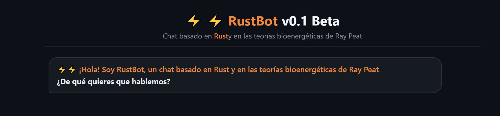
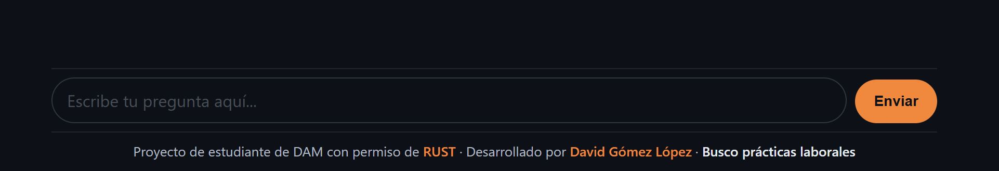

# ⚡⚡ RustBot

Proyecto de Chatbot con RAG (Retrieval-Augmented Generation) especializado en nutrición, metabolismo y bioenergética, con la personalidad del divulgador [Rust](https://www.youtube.com/@rustkolnikov), inspirado en la obra de Ray Peat sin gastar dinero en servicios.

Soy estudiante del ciclo de **DAM (Desarrollo de Aplicaciones Multiplataforma)** en búsqueda de prácticas laborales en Valencia o alrededores.
**Mi CV https://david-gl2.github.io/CV/**

**🔗 Demo en vivo:** [https://rustbot-render.onrender.com](https://rustbot-render.onrender.com) — funciona sobre hardware personal, así que puede tardar unos 50 segundos en despertar o estar puntualmente offline ya que depende de que tenga los servicios activos.




---

## Sobre el proyecto

Empezó como un ejercicio de aprendizaje sobre la IA: montar un asistente/agente de IA auto alojado en mi propio PC (OLLAMA), de principio a fin — desde los embeddings hasta el modelo de generación. Para emular un proyecto laboral real, decidí hacer como si el divulgador Rust fuese el cliente, por lo tanto, la base de datos está creada desde 0 por mi. Utilicé sus recursos audiovisuales para extraer la información + otros divulgadores, autores, libros, artículos, etc. Toda esa información la procesé y la organicé usando Obsidian.

Según avanzaba fui externalizando piezas a propósito, para practicar también esos flujos: base de datos vectorial en MongoDB Atlas, despliegue de la API y página web/chat en Render. Una vez el servicio funcionaba me dediqué a hacer pruebas de ensayo/error con las preguntas para proceder a añadirle parámetros, restricciones, contexto, etc. Cambiar los modelos para mejorar resultados según veía que mi equipo podía soportarlo, terminando por usar gemma2:9b, también probando varios modelos de embeddings.

El resultado es una arquitectura híbrida deliberada, parte en la nube gratuita, parte en mi propio hardware ya que entiendo que el futuro será un mix de agentes IA locales + servicios en la nube. El servicio funciona relativamente, teniendo en cuenta las limitaciones del equipo, recursos y modelo.


## Arquitectura

```
[Navegador] → [Render: FastAPI + frontend]
                     │
                     ├──→ [MongoDB Atlas: Vector Search]
                     │
                     └──→ [Tailscale Funnel] → [Mi PC]
                                                  ├─ Ollama (generación)
                                                  └─ Servidor de embeddings
```

**Flujo de una consulta:**
1. El usuario escribe una pregunta en el frontend (servido por FastAPI en Render).
2. La API genera el embedding de la pregunta llamando al servidor de embeddings en mi PC (vía proxy + Tailscale Funnel).
3. Se ejecuta una búsqueda `$vectorSearch` en MongoDB Atlas para recuperar los fragmentos más relevantes de la base de conocimiento.
4. Si hay contexto relevante, se construye un prompt con la personalidad de Rust y se envía a Ollama (en mi PC) para generar la respuesta.
5. Si no hay contexto relevante, el bot lo dice explícitamente en vez de inventar una respuesta (en teoria).

## Stack tecnológico

| Capa | Tecnología |
|---|---|
| Gestión de la BD | Obsidian |
| Frontend | HTML + CSS + JS vanilla |
| Backend | FastAPI (Python) |
| Hosting API/web | Render (plan gratuito) |
| Base de datos vectorial | MongoDB Atlas (Vector Search - plan gratuito) |
| Embeddings | `paraphrase-multilingual-mpnet-base-v2` (SentenceTransformers), servidos desde mi PC |
| Generación | Ollama, local, en mi propia GPU (RTX 4070) |
| Exposición del PC a internet | Tailscale Funnel |


## Características

- **RAG real**: las respuestas están ancladas a una base de conocimiento propia (transcripciones y resúmenes de más de 180 vídeos/documentos, troceados y vectorizados), no a conocimiento genérico del modelo.
- **Personalidad consistente**: el bot responde en la voz de Rust, no como un asistente neutro.
- **Restricción de dominio**: se niega a opinar de política, actualidad o religión, y no da diagnósticos médicos.
- **Honestidad ante la falta de datos**: si no tiene contexto suficiente sobre un tema, lo dice en vez de improvisar.

## Limitaciones conocidas

Con toda transparencia — esto es un proyecto de aprendizaje sobre hardware personal, no un producto:

- El modelo de generación corre en local (`gemma2:9b`) por límites de VRAM de mi GPU. Es notablemente más pequeño que los modelos de las APIs comerciales, y en preguntas donde el contexto recuperado contradice ideas muy asentadas (por ejemplo, el paradigma clásico de "balance calórico" frente al enfoque bioenergético), a veces el modelo tira hacia el conocimiento general en vez de ceñirse estrictamente al contexto — algo que documenté y mitigué (filtros server-side) pero que no elimina del todo con un modelo de este tamaño.
- Al depender de mi PC personal para la generación y los embeddings, el servicio puede estar puntualmente offline si mi equipo se apaga, se reinicia o pierde conexión.
- Render en su plan gratuito "duerme" tras inactividad — la primera consulta tras un rato sin uso puede tardar 30-50 segundos en responder.

## Estado del proyecto

Demo activa mientras dure mi búsqueda de prácticas (a partir de septiembre de 2026). Si el enlace no responde, probablemente mi PC esté apagado en ese momento — este README describe la arquitectura y las decisiones técnicas del proyecto. Posiblemente intente migrar todo el proyecto a la nube, llevando también el modelo al plan gratuito de Groq.


## Autor

**David Gómez López** — estudiante de DAM buscando prácticas.
[CV / Portfolio](https://david-gl2.github.io/CV/)

---

*Proyecto desarrollado con permiso de [Rust](https://www.youtube.com/@rustkolnikov).*
